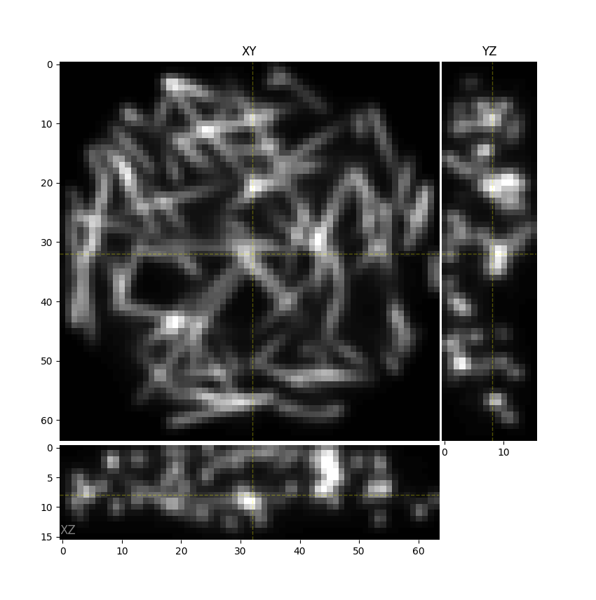

# microsim

Microscope simulation library for generating realistic microscope images.

## Installation

### from PyPI

```bash
pip install "microsim[all]"
```

!!! note
    At the moment, this library is a bit more "application" than it
    is "library".  If you are following the docs or tutorials, its
    probably best to install the full `[all]` extra, which brings in
    io, visualization, and other data-fetching dependencies.  However,
    the bare minimal install is fully functional for generating data.

### From github

To get the bleeding edge version, which will change rapidly, you can install from github.

```bash
pip install "microsim[all] @ git+https://github.com/tlambert03/microsim"
```

### With GPU support

If available, microsim can use either Jax or Cupy to accelerate computations.
These are not installed by default, see the
[jax](https://jax.readthedocs.io/en/latest/installation.html)
or [cupy](https://docs.cupy.dev/en/stable/install.html) installation instructions,
paying attention to your GPU requirements.  Support for torch is not fully
implemented yet, but is planned.

## Quickstart

Construct and run a [`microsim.Simulation`][] object.

=== "using objects"

    ```python
    from microsim import schema as ms
    from microsim.util import ortho_plot

    sim = ms.Simulation(
        truth_space=ms.ShapeScaleSpace(shape=(128, 512, 512), scale=(0.02, 0.01, 0.01)),
        output_space={'downscale': 8},
        sample=ms.Sample(
            labels=[ms.MatsLines(density=0.5, length=30, azimuth=5, max_r=1)]
        ),
        modality=ms.Confocal(pinhole_au=0.2),
    )
    result = sim.run()
    ortho_plot(result)
    ```

=== "using dicts"

    If you don't like importing all the names, you can also use
    dictionaries, and pydantic will convert them to the correct
    objects.
    
    ```python
    from microsim import Simulation
    from microsim.util import ortho_plot

    sim = Simulation(
        truth_space={'shape': (128, 512, 512), 'scale': (0.02, 0.01, 0.01)},
        output_space={'downscale': 8},
        sample=dict(
            labels=[
                {   
                    'type': 'matslines',
                    'density': 0.5,
                    'length': 30,
                    'azimuth': 5,
                    'max_r': 1,
                }
            ]
        ),
        modality={'type': 'confocal', 'pinhole_au': 0.2}
    )
    result = sim.run()
    ortho_plot(result)
    ```



Note that you can also construct a simulation from a JSON object.
This is particularly useful with the `output` parameter, to dump
the result of the simulation to a file.

```json title="confocal.json"
{
    "truth_space": {
        "shape": [128, 512, 512],
        "scale": [0.02, 0.01, 0.01]
    },
    "output_space": {
        "downscale": 8
    },
    "sample": {
        "labels": [
        {
            "type": "matslines",
            "density": 0.5,
            "length": 30,
            "azimuth": 5,
            "max_r": 1
        }
        ]
    },
    "modality": {
        "type": "confocal",
        "pinhole_au": 0.2
    },
    "output": "au02.tiff"
}
```

... and then load a `Simulation` from that file and [`run()`][microsim.Simulation.run].

```python
from microsim import Simulation
from pathlib import Path

spec = Path('confocal.json').read_text()
sim = Simulation.model_validate_json(spec)
sim.run()
```

For more details, see the [tutorial](./tutorial.ipynb), [conceptual
overview](./concept.md) and the [API docs](./api)
